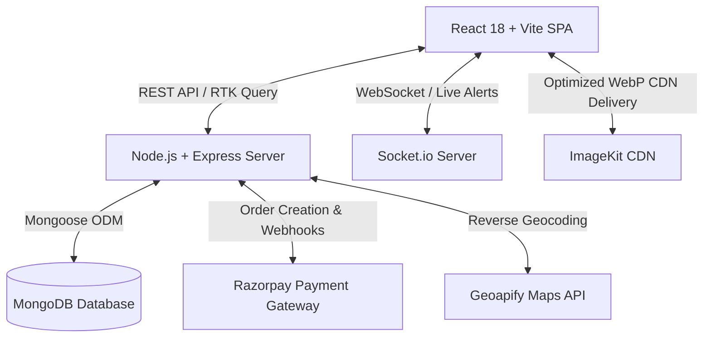

# 🏡 StayHub — Full-Stack Property Booking & Hospitality Management Platform

[](https://reactjs.org/)
[](https://vitejs.dev/)
[](https://redux-toolkit.js.org/)
[](https://nodejs.org/)
[](https://expressjs.com/)
[](https://www.mongodb.com/)
[](https://socket.io/)
[](https://razorpay.com/)
[](https://tailwindcss.com/)

**StayHub** is a modern, full-stack web application designed for seamless property discovery, reservations, and host operations. Built with a responsive mobile-first design system, it delivers an intuitive guest booking experience alongside powerful property and earnings management tools for hosts.

---

## 📑 Table of Contents

- [Key Features](#-key-features)
  - [Guest Experience](#1-guest-experience)
  - [Host & Owner Operations](#2-host--owner-operations)
  - [Platform & Real-Time Features](#3-platform--real-time-features)
- [System Architecture](#-system-architecture)
- [Tech Stack](#-tech-stack)
- [Project Structure](#-project-structure)
- [API Reference](#-api-reference)
- [Real-Time WebSocket Events](#-real-time-websocket-events)
- [Image Optimization with ImageKit](#-image-optimization-with-imagekit)
- [Environment Variables](#-environment-variables)
- [Getting Started & Local Setup](#-getting-started--local-setup)
- [Deployment](#-deployment)
- [Quality & Performance Optimizations](#-quality--performance-optimizations)
- [License](#-license)

---

## ✨ Key Features

### 1. Guest Experience
- **Cinematic Hero Experience**: Auto-advancing visual slideshow featuring smooth Ken Burns zoom effects and floating ambient canvas particles.
- **Dynamic Property Discovery**:
  - Browse stays across multiple categories: *Villas, Resorts, Apartments, Cottages, Hotels, Hostels, and Houses*.
  - City-based exploration cards with responsive image previews.
  - Real-time search filters for stay types (daily/monthly), guest capacities, price ranges, and facilities.
- **Detailed Stay Profiles**:
  - High-resolution image galleries with ImageKit CDN delivery.
  - Interactive Leaflet map with custom SVG pinpoint markers, downward stems, beacon pulses, and instant navigation links.
  - Verified amenities checklist (WiFi, Parking, AC, Gym, Laundry, Balcony).
  - Customer review submissions and dynamic average rating calculations.
- **Instant Checkout & Secure Payments**:
  - Integrated Razorpay checkout workflow for authentic test/live transactions.
  - Backend cryptographic signature verification (`HMAC-SHA256`).
- **Wishlist Management**:
  - Quick-save heart toggling with optimistic UI updates.
  - Mobile-optimized compact list rows with quick property jump links.
- **Bookings & Trip History**:
  - View upcoming and past reservations with booking reference IDs, stay duration, check-in dates, and total amounts.
  - Instant cancellation with automated notification dispatch.

### 2. Host & Owner Operations
- **Role Upgrade**: One-click transition from guest to host/property owner.
- **Properties Management (`/my-properties`)**:
  - Tabbed overview (`All`, `Active`, `Drafts`) with status badges (`LIVE` vs. `DRAFT`).
  - Space-efficient horizontal cards showing thumbnail, category, location, pricing, and direct action triggers (`View`, `Edit`, `Delete`).
- **Interactive Add/Edit Property Modal**:
  - Step-by-step wizard for property details, category selection, and stay types.
  - Location picker with interactive coordinate selection and reverse geocoding via Geoapify.
  - Live photo URL preview gallery.
- **Host Earnings & Reservation Tracking (`/earnings`)**:
  - 12-column responsive layout displaying property titles, guest profiles, reservation dates, payout amounts, and real-time status (`Paid`, `Confirmed`, `Cancelled`).
  - Summary metric cards showing total host revenue, completed stays, and active bookings.

### 3. Platform & Real-Time Features
- **Live Notifications (`Socket.io`)**:
  - Instant notification toast banners and interactive notification center.
  - Real-time alerts for booking confirmations, cancellations, check-in reminders, and review prompts.
  - Unread count badges synchronized across browser tabs.
- **Theme Customization**:
  - Full Dark Mode and Light Mode support with smooth CSS transitions.
  - User preference persisted in `localStorage`.
- **Seamless Navigation**:
  - Automated `ScrollToTop` restoration on route transitions.
  - Universal `BackButton` components across sub-pages.
  - Fully protected routing for guest, public, and owner-only views.

---

## 🏛 System Architecture



---

## 🛠 Tech Stack

### Frontend
- **Framework**: React 18.3.1
- **Build Tool**: Vite 5.4.10
- **State Management & Caching**: Redux Toolkit & RTK Query
- **Routing**: React Router DOM (v7)
- **Real-Time Client**: Socket.io Client (v4.8.3)
- **Styling**: Tailwind CSS (Utility-first CSS) + Custom Glassmorphism & Micro-animations
- **Mapping**: Leaflet + OpenStreetMap + Geoapify Reverse Geocoding
- **Asset Optimization**: ImageKit CDN Web Proxy

### Backend
- **Runtime**: Node.js (ES Modules `type: module`)
- **Server Framework**: Express 5.1.0
- **Database**: MongoDB with Mongoose ODM 8.19.1
- **Authentication**: JSON Web Tokens (`jsonwebtoken`) + `bcryptjs` + `cookie-parser`
- **Real-Time**: Socket.io (v4.8.3)
- **Payment Processing**: Official Razorpay Node SDK (v2.9.6)
- **Performance & Security**: `compression` (Gzip), `express-rate-limit`, `cors`

---

## 📂 Project Structure

```text
StayHub/
├── backend/
│   ├── config/
│   │   ├── database.js          # MongoDB connection handler
│   │   └── socket.js            # Socket.io server instance & room dispatch
│   ├── features/
│   │   ├── address/             # Reverse geocoding & location parsing
│   │   │   └── routes.js
│   │   ├── auth/                # Authentication, profile, wishlist & roles
│   │   │   ├── authController.js
│   │   │   └── routes.js
│   │   ├── bookings/            # Razorpay orders, verification, earnings & reviews
│   │   │   ├── bookingController.js
│   │   │   └── routes.js
│   │   ├── notifications/       # Notification fetch, read/clear & count
│   │   │   ├── notificationController.js
│   │   │   └── routes.js
│   │   └── rooms/               # Property CRUD, city listing & filters
│   │       ├── roomController.js
│   │       └── routes.js
│   ├── middleware/
│   │   └── auth.js              # JWT & session verification middleware
│   ├── models/
│   │   ├── Booking.js           # Booking schema with payment metadata
│   │   ├── Notification.js      # Notification schema with user references
│   │   ├── Room.js              # Room & stay listing schema
│   │   └── User.js              # User schema with roles & wishlist
│   ├── utils/
│   │   └── addressParser.js     # Geoapify address parser
│   ├── package.json
│   └── server.js                # Express & Socket.io server entry point
│
├── frontend/
│   ├── public/
│   │   ├── stayhub-logo.png     # StayHub branding logo
│   │   └── vite.svg
│   ├── src/
│   │   ├── api/
│   │   │   ├── apiSlice.js      # Central RTK Query API slice & tag invalidation
│   │   │   └── httpClient.js    # Axios client instance
│   │   ├── components/          # Reusable shared UI components
│   │   │   ├── AddEditRoomModal.jsx
│   │   │   ├── BackButton.jsx
│   │   │   ├── BrandLogo.jsx
│   │   │   ├── CityCard.jsx
│   │   │   ├── EditProfileModal.jsx
│   │   │   ├── Footer.jsx
│   │   │   ├── InputField.jsx
│   │   │   ├── MapLocationSelector.jsx
│   │   │   ├── Navigation.jsx
│   │   │   ├── ProtectedRoute.jsx
│   │   │   ├── PublicRoute.jsx
│   │   │   ├── RoomCard.jsx
│   │   │   ├── ScrollToTop.jsx
│   │   │   ├── Skeletons.jsx
│   │   │   ├── Toast.jsx
│   │   │   └── UserMenu.jsx
│   │   ├── features/            # Modular feature domains
│   │   │   ├── auth/            # Login, Signup, Auth forms
│   │   │   ├── bookings/        # Bookings, Earnings & Checkout
│   │   │   ├── notifications/   # Real-time bell, toasts & notification list
│   │   │   ├── profile/         # User profile & host upgrade
│   │   │   ├── rooms/           # Home, City listings, Details, My Properties
│   │   │   └── wishlist/        # Wishlist list page
│   │   ├── store/               # Redux store & global app slices
│   │   │   ├── appSlice.js
│   │   │   ├── index.js
│   │   │   └── roomsSlice.js
│   │   ├── utils/
│   │   │   └── imageKitOptimizer.js # Dynamic CDN transformation helper
│   │   ├── App.jsx              # Main router & app layout
│   │   ├── constants.jsx        # App configuration & SVG icons
│   │   ├── main.jsx             # React DOM root & providers
│   │   └── styles.css           # Global custom styles & Tailwind directives
│   ├── index.html
│   ├── package.json
│   └── vite.config.js
│
├── mdfiles/                     # Architecture, optimization & test reports
└── README.md
```

---

## 🔌 API Reference

### 1. Configuration & Health
| Method | Endpoint | Description | Auth Required |
| :--- | :--- | :--- | :--- |
| `GET` | `/` | API Health Check | No |
| `GET` | `/api/config` | Exposes public keys (`geoApiKey`, `razorpayKeyId`) | No |

### 2. Authentication & User Profile (`/api/auth`)
| Method | Endpoint | Description | Auth Required |
| :--- | :--- | :--- | :--- |
| `POST` | `/api/auth/register` | Register new user account | No |
| `POST` | `/api/auth/login` | Log in user and generate JWT | No |
| `GET` | `/api/auth/me` | Fetch currently authenticated user | Yes |
| `PUT` | `/api/auth/profile` | Update profile information | Yes |
| `POST` | `/api/auth/become-owner` | Upgrade user account role to `owner` | Yes |
| `POST` | `/api/auth/logout` | Clear authentication cookie/session | Yes |
| `GET` | `/api/auth/wishlist` | Retrieve user's saved wishlist properties | Yes |
| `POST` | `/api/auth/wishlist/:roomId` | Toggle property in/out of wishlist | Yes |

### 3. Properties & Stays (`/api/rooms`)
| Method | Endpoint | Description | Auth Required |
| :--- | :--- | :--- | :--- |
| `GET` | `/api/rooms` | Search & list properties (with filtering & pagination) | No |
| `GET` | `/api/rooms/cities/list` | Aggregate properties by city | No |
| `GET` | `/api/rooms/mine` | List all properties owned by current host | Yes (Owner) |
| `GET` | `/api/rooms/:id` | Fetch complete property details | No |
| `POST` | `/api/rooms/add` | Create new property listing | Yes (Owner) |
| `PUT` | `/api/rooms/edit/:id` | Update property listing details | Yes (Owner) |
| `DELETE` | `/api/rooms/delete/:id` | Remove a property listing | Yes (Owner) |

### 4. Bookings & Payments (`/api/bookings`)
| Method | Endpoint | Description | Auth Required |
| :--- | :--- | :--- | :--- |
| `POST` | `/api/bookings/razorpay/order` | Generate Razorpay order for reservation | Yes |
| `POST` | `/api/bookings/razorpay/verify` | Verify payment signature and create booking record | Yes |
| `GET` | `/api/bookings` | Fetch current guest's booking history | Yes |
| `DELETE` | `/api/bookings/:id` | Cancel an active booking | Yes |
| `GET` | `/api/bookings/host-earnings` | Retrieve host revenue analytics & payouts | Yes (Owner) |
| `GET` | `/api/bookings/booked-list` | Retrieve list of guest bookings on host listings | Yes (Owner) |
| `POST` | `/api/bookings/reviews/submit` | Submit rating & review for completed stay | Yes |
| `GET` | `/api/bookings/reviews/status/:roomId` | Check review eligibility for a property | Yes |

### 5. Real-Time Notifications (`/api/notifications`)
| Method | Endpoint | Description | Auth Required |
| :--- | :--- | :--- | :--- |
| `GET` | `/api/notifications` | Fetch user notification history (paginated) | Yes |
| `GET` | `/api/notifications/unread-count` | Retrieve unread notification badge count | Yes |
| `PATCH` | `/api/notifications/:id/read` | Mark individual notification as read | Yes |
| `PATCH` | `/api/notifications/mark-all-read` | Mark all user notifications as read | Yes |
| `DELETE` | `/api/notifications/:id` | Delete individual notification record | Yes |
| `DELETE` | `/api/notifications/clear-all` | Clear all notifications for user | Yes |

### 6. Address & Geolocation (`/api/address`)
| Method | Endpoint | Description | Auth Required |
| :--- | :--- | :--- | :--- |
| `GET` | `/api/address/reverse-geocode` | Resolve latitude/longitude to street & city | No |

---

## ⚡ Real-Time WebSocket Events

StayHub utilizes Socket.io for bidirectional communication between the server and clients.

- **Authentication**: Sockets authenticate via JWT token or `userId` during connection handshake.
- **User Room**: Each authenticated user joins a private room: `user:<userId>`.

| Event Name | Direction | Payload | Trigger |
| :--- | :--- | :--- | :--- |
| `notification` | Server $\rightarrow$ Client | Full Notification Object | Dispatched when a booking is confirmed, cancelled, or reviewed |
| `register_user` | Client $\rightarrow$ Server | `userId` | Emitted on login to register socket into personal room |

---

## 🖼 Image Optimization with ImageKit

StayHub optimizes all property and city photography using an ImageKit Web Proxy pipeline ([imageKitOptimizer.js](frontend/src/utils/imageKitOptimizer.js)):

- **Automatic Format Conversion**: Converts standard JPEG/PNG to next-gen **WebP** formats automatically.
- **Dynamic Resizing**:
  - `getRoomCardThumbnail()`: Resizes to `400x300` at `70%` quality for fast grid/list rendering.
  - `getCityCardImage()`: Resizes to `400x225` for responsive 16:9 city cards.
  - `getRoomDetailImage()`: Serves high-definition `800px` images for property showcases.
- **Responsive Srcsets**: Dynamically generates `300w`, `400w`, `500w`, and `600w` srcset definitions for crisp display on mobile, tablet, and retina screens.

---

## 🔐 Environment Variables

### Backend Configuration (`backend/.env`)

```env
# Server Port
PORT=5000

# MongoDB Database Connection
MONGO_URI=mongodb+srv://<username>:<password>@cluster0.mongodb.net/stayhub?retryWrites=true&w=majority
MONGO_FALLBACK_URI=mongodb://127.0.0.1:27017/stayhub

# JWT Authentication Secret
JWT_SECRET=your_jwt_super_secret_key_here

# Geoapify API Key (for address auto-completion & geocoding)
GEOAPIFY_API_KEY=your_geoapify_key

# Razorpay Test / Live Credentials
RAZORPAY_KEY_ID=rzp_test_xxxxxxxxxx
RAZORPAY_KEY_SECRET=your_razorpay_secret_key

# CORS Allowed Frontend URLs (comma-separated for multiple origins)
FRONTEND_URLS=http://localhost:5173,https://stay-hub-psi.vercel.app
```

### Frontend Configuration (`frontend/.env`)

```env
# API Gateway Target URL (leave empty in local dev to default to http://localhost:5000)
VITE_API_URL=http://localhost:5000
```

---

## 🚀 Getting Started & Local Setup

### Prerequisites
- [Node.js](https://nodejs.org/) (version 18 or higher recommended)
- [MongoDB](https://www.mongodb.com/) (Local instance or MongoDB Atlas cluster URI)
- [npm](https://www.npmjs.com/) or [yarn](https://yarnpkg.com/)

### 1. Clone the Repository
```bash
git clone https://github.com/ShresthDw/StayHub.git
cd StayHub
```

### 2. Install Backend Dependencies & Start Server
```bash
cd backend
npm install
npm start
```
*The backend server will launch on `http://localhost:5000`.*

### 3. Install Frontend Dependencies & Start Development Server
```bash
cd ../frontend
npm install
npm run dev
```
*The frontend application will be live on `http://localhost:5173`.*

---

## 🚢 Deployment

### Production Deployment Strategy
- **Frontend**: Deployed on **Vercel** with automatic Git deployments from `frontend/`.
- **Backend**: Deployed on **Render** (using `backend/` as root directory and `render.yaml`).
- **Database**: **MongoDB Atlas** Cloud Database.

```yaml
# render.yaml
services:
  - type: web
    name: stayhub-backend
    env: node
    plan: free
    rootDir: backend
    buildCommand: npm install
    startCommand: npm start
    envVars:
      - key: PORT
        value: 5000
      - key: MONGO_URI
        sync: false
      - key: JWT_SECRET
        sync: false
      - key: RAZORPAY_KEY_ID
        sync: false
      - key: RAZORPAY_KEY_SECRET
        sync: false
      - key: GEOAPIFY_API_KEY
        sync: false
```

---

## ⚡ Quality & Performance Optimizations

1. **RTK Query Smart Caching**: Automated cache invalidation using granular tag types (`Rooms`, `MyRooms`, `Bookings`, `Wishlist`, `Notifications`, `User`), preventing redundant network roundtrips.
2. **Gzip & Brotli Compression**: Enabled via `compression` middleware on all JSON responses.
3. **API Rate Limiting**: Global requests limited to `30,000` per 15-minute window with dedicated `500` request limits on authentication routes.
4. **Instant Scroll Restoration**: Dedicated `ScrollToTop` hook ensures route changes immediately reset window offset to position `(0, 0)`.
5. **Zero Layout Shifts**: Skeleton placeholders and defined aspect ratios on all responsive image containers prevent cumulative layout shift (CLS).

---

## 📄 License

This project is licensed under the **ISC License**.
